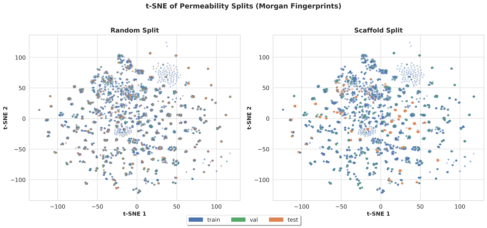
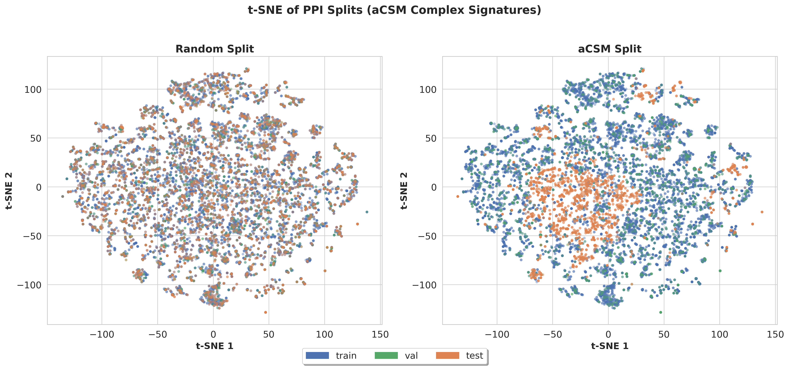

# HELM-BERT

A peptide language model using **HELM (Hierarchical Editing Language for Macromolecules)** notation, compatible with Hugging Face Transformers.

[](https://huggingface.co/Flansma/helm-bert)

## Model Description

HELM-BERT is built upon the DeBERTa architecture, pre-trained on ~75k peptides from four databases (ChEMBL, CREMP, CycPeptMPDB, Propedia) using **Masked Language Modeling (MLM)** with a **Warmup-Stable-Decay (WSD)** learning rate schedule.

- **Disentangled Attention**: Decomposes attention into content-content and content-position terms
- **Enhanced Mask Decoder (EMD)**: Injects absolute position embeddings at the decoder stage
- **Span Masking**: Contiguous token masking with geometric distribution
- **nGiE**: n-gram Induced Encoding layer (1D convolution, kernel size 3)

<p align="center"></p>

## Model Specifications

| Parameter | Value |
|-----------|-------|
| Parameters | 54.8M |
| Hidden size | 768 |
| Layers | 6 |
| Attention heads | 12 |
| Vocab size | 78 |
| Max token length | 512 |
| Pre-training data | ~75k peptides (ChEMBL, CREMP, CycPeptMPDB, Propedia) |
| Pre-training objective | MLM (span masking, p=0.15) |
| LR schedule | Warmup-Stable-Decay (WSD) |

## Installation

```bash
uv venv --python 3.11 && source .venv/bin/activate
uv pip install -r requirements.txt
```

## Quick Start

```bash
# Permeability (choose split)
python scripts/train_permeability.py --config configs/permeability_random.yaml
python scripts/train_permeability.py --config configs/permeability_scaffold.yaml

# PPI classification (choose split)
python scripts/train_ppi.py --config configs/ppi_random.yaml
python scripts/train_ppi.py --config configs/ppi_acsm.yaml
```

Override settings via CLI: `training.batch_size=64 training.encoder_lr=1e-4`

## Inference

```python
from transformers import AutoModel, AutoTokenizer

model = AutoModel.from_pretrained("Flansma/helm-bert", trust_remote_code=True)
tokenizer = AutoTokenizer.from_pretrained("Flansma/helm-bert", trust_remote_code=True)

# Cyclosporine A
inputs = tokenizer("PEPTIDE1{[Abu].[Sar].[meL].V.[meL].A.[dA].[meL].[meL].[meV].[Me_Bmt(E)]}$PEPTIDE1,PEPTIDE1,1:R1-11:R2$$$", return_tensors="pt")
outputs = model(**inputs)
embeddings = outputs.last_hidden_state
```

## Training

### MLM Pre-training

```bash
# Continue pre-training from Hub model (default)
python scripts/train_mlm.py
python scripts/train_mlm.py --batch_size 128 --lr 5e-5

# From scratch
python scripts/train_mlm.py --from_scratch

# From scratch with custom architecture
python scripts/train_mlm.py --from_scratch \
    model.architecture.num_hidden_layers=12 \
    model.architecture.hidden_size=768
```

**Key configuration options** (`configs/mlm.yaml`):

| Config Key | Default | Description |
|------------|---------|-------------|
| `model.pretrained_path` | Flansma/helm-bert | Base model for continue pre-training |
| `model.from_scratch` | false | Train from scratch |
| `model.architecture.hidden_size` | 768 | Hidden dimension (from_scratch only) |
| `model.architecture.num_hidden_layers` | 6 | Number of layers (from_scratch only) |
| `training.max_epochs` | 100 | Maximum training epochs |
| `training.batch_size` | 64 | Batch size |
| `training.learning_rate` | 1e-4 | Learning rate |
| `data.masking.mlm_probability` | 0.15 | Masking probability |

### Permeability Prediction

```bash
# Random split
python scripts/train_permeability.py --config configs/permeability_random.yaml

# Scaffold split
python scripts/train_permeability.py --config configs/permeability_scaffold.yaml

# Override settings
python scripts/train_permeability.py --config configs/permeability_random.yaml model.freeze_encoder=true training.head_lr=1e-3

# Use local checkpoint
python scripts/train_permeability.py --config configs/permeability_random.yaml model.pretrained_path=./checkpoints/my-model

# Custom data
python scripts/train_permeability.py --config configs/permeability_random.yaml data.train_file=./data/train.csv data.test_file=./data/test.csv
```

**Key configuration options** (`configs/permeability.yaml`):

| Config Key | Default | Description |
|------------|---------|-------------|
| `model.pretrained_path` | Flansma/helm-bert | Pretrained model path |
| `model.freeze_encoder` | false | Freeze encoder weights |
| `model.classifier.num_layers` | 2 | MLP head layers |
| `model.classifier.dropout` | 0.1 | Classifier dropout |
| `training.max_epochs` | 100 | Maximum training epochs |
| `training.batch_size` | 32 | Batch size |
| `training.encoder_lr` | 3e-5 | Encoder learning rate |
| `training.head_lr` | 1e-4 | Head learning rate |
| `evidence.lambda_coeff` | 0.01 | NIG evidence regularization weight |

Outputs: `pred, actual, aleatoric_uncertainty, epistemic_uncertainty`

### PPI Classification

Uses HELM-BERT (peptide) + ESM-2 (protein) dual encoder architecture.

```bash
# Random split
python scripts/train_ppi.py --config configs/ppi_random.yaml

# aCSM split
python scripts/train_ppi.py --config configs/ppi_acsm.yaml

# Fine-tune drug encoder (unfreeze)
python scripts/train_ppi.py --config configs/ppi_random.yaml --freeze_drug_encoder false
```

**Key configuration options** (`configs/ppi.yaml` + `configs/ppi_random.yaml` or `configs/ppi_acsm.yaml`):

| Config Key | Default | Description |
|------------|---------|-------------|
| `model.drug_encoder.pretrained_path` | Flansma/helm-bert | Drug encoder model |
| `model.drug_encoder.freeze` | true | Freeze drug encoder |
| `model.target_encoder.pretrained_path` | facebook/esm2_t33_650M_UR50D | Target encoder |
| `model.target_encoder.freeze` | true | Freeze target encoder |
| `training.use_cached_embeddings` | true | Use pre-computed embeddings |
| `training.max_epochs` | 50–70 | Maximum training epochs (split-dependent) |
| `training.batch_size` | 32 | Batch size |
| `training.encoder_lr` | 3e-5 | Encoder learning rate |
| `training.head_lr` | 1e-4 | Head learning rate |
| `evidence.lambda_coeff` | 0.15 | Dirichlet evidence regularization weight |

Outputs: `pred_prob, pred_label, actual, uncertainty`

### Common Options

These options apply to all training scripts (`configs/default.yaml`):

| Config Key | Default | Description |
|------------|---------|-------------|
| `training.seed` | 42 | Random seed |
| `training.gradient_clip_val` | 1.0 | Gradient clipping |
| `hardware.devices` | auto | GPU devices |
| `hardware.precision` | 32-true | 32-true, 16-mixed, bf16-mixed |
| `logging.disable_wandb` | false | Disable WandB logging |

### Uncertainty Quantification

All downstream tasks use Evidential Deep Learning ([Soleimany et al. 2021](https://pubs.acs.org/doi/10.1021/acscentsci.1c00546), [Sensoy et al. 2018](https://proceedings.neurips.cc/paper/2018/hash/a981f2b708044d6fb4a71a1463242520-Abstract.html)) for per-prediction uncertainty estimates:

| Task | Distribution | Uncertainty Output |
|------|-------------|-------------------|
| Permeability | Normal-Inverse-Gamma | Aleatoric (data noise) + Epistemic (model uncertainty) |
| PPI | Dirichlet | Total uncertainty (K/S) |

The `evidence.lambda_coeff` controls the regularization strength between task loss and evidence penalty.

## Performance

### Permeability Regression (CycPeptMPDB)

| Split | Target | R² | Pearson | RMSE | MAE |
|:-----:|:------:|:--:|:-------:|:----:|:---:|
| Random | Mixed | 0.769 | 0.878 | 0.388 | 0.269 |
| Random | PAMPA | 0.765 | 0.875 | 0.384 | 0.275 |
| Random | Caco-2 | 0.758 | 0.876 | 0.414 | 0.303 |
| Scaffold | Mixed | 0.643 | 0.812 | 0.380 | 0.284 |
| Scaffold | PAMPA | 0.627 | 0.810 | 0.372 | 0.281 |
| Scaffold | Caco-2 | 0.698 | 0.849 | 0.383 | 0.287 |

Train/test 9:1, val 10% from train. Scaffold split by Murcko scaffolds.

<p align="center"></p>

### PPI Classification (Propedia v2)

| Split | ROC-AUC | PR-AUC | F1 | MCC | Balanced Acc |
|:-----:|:-------:|:------:|:--:|:---:|:------------:|
| Random | 0.972 | 0.912 | 0.859 | 0.824 | 0.911 |
| aCSM | 0.868 | 0.702 | 0.613 | 0.559 | 0.735 |

Train/test 8:2, val 10% from train, 1:4 positive:negative ratio.
- **Random**: random split
- **aCSM**: clustering-based split on aCSM-ALL complex signatures with protein overlap pruning

<p align="center"></p>

## Paper Checkpoint

The original model from [arXiv:2512.23175](https://arxiv.org/abs/2512.23175) (pre-trained on 3 databases, without CREMP/WSD) is available via:

```python
model = AutoModel.from_pretrained("Flansma/helm-bert", revision="paper", trust_remote_code=True)
```

## Citation

If you use HELM-BERT in your research, please cite:

```bibtex
@article{lee2025helmbert,
  title={HELM-BERT: A Transformer for Medium-sized Peptide Property Prediction},
  author={Seungeon Lee and Takuto Koyama and Itsuki Maeda and Shigeyuki Matsumoto and Yasushi Okuno},
  journal={arXiv preprint arXiv:2512.23175},
  year={2025},
  url={https://arxiv.org/abs/2512.23175}
}
```

## License

MIT License
